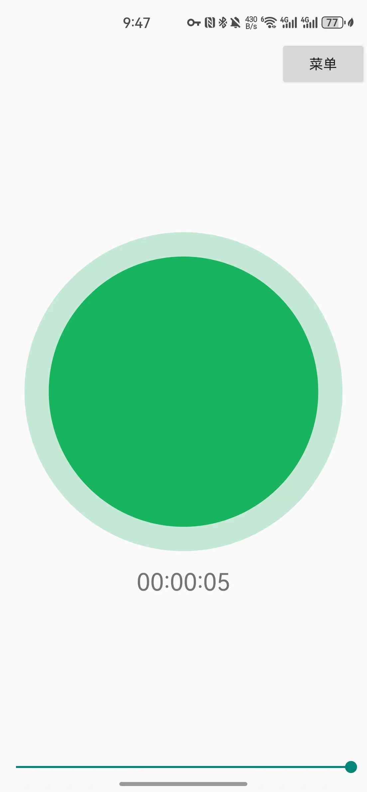
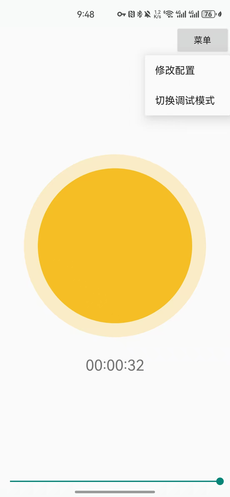
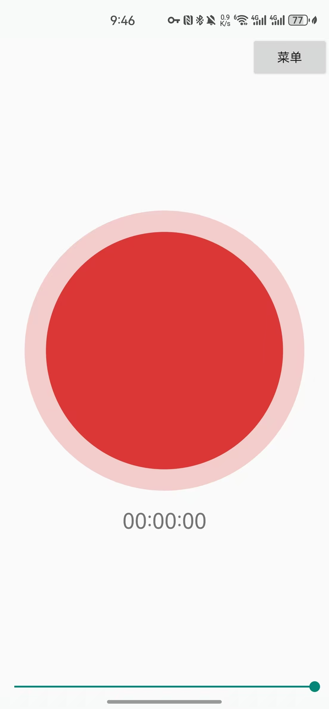
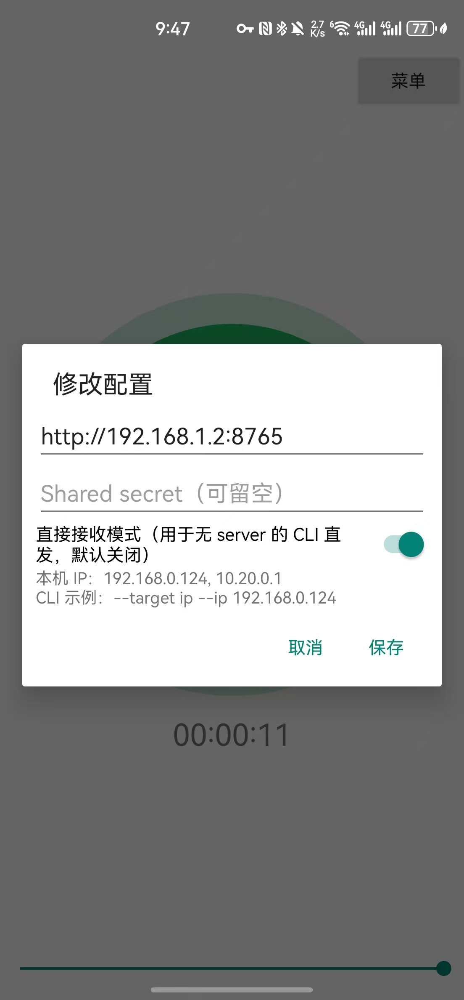
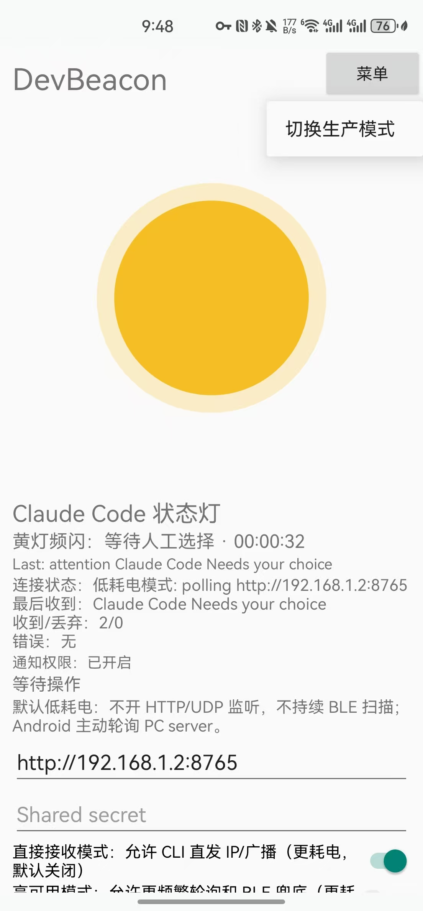
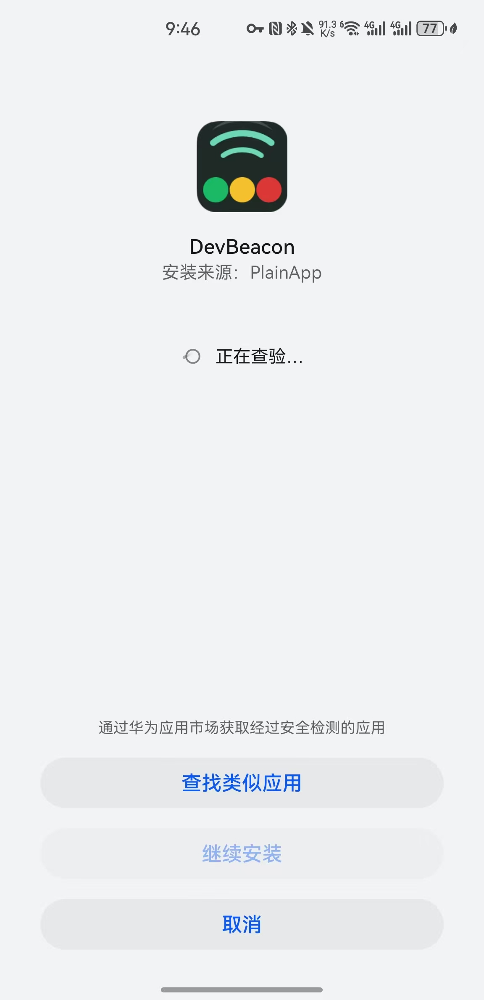

# DevBeacon

[简体中文](README.zh-CN.md) | English

DevBeacon is a local PC-to-Android notification bridge for Claude Code and other developer workflow events. The Android app shows a simple traffic-light panel: green for running, yellow for attention needed, and red for done or idle.

Battery conservation is the default. In normal production mode Android actively polls the PC server and does not open a direct listener. Direct receive mode is available when you explicitly want one-shot CLI sends without starting the PC server.

## App preview

Production mode is designed as a quiet status lamp: the phone can sit beside the keyboard and show Claude Code state at a glance without extra text. Green means running, yellow means waiting for human input, and red means idle or finished.

<table>
  <tr>
    <td align="center"><strong>Running</strong></td>
    <td align="center"><strong>Attention</strong></td>
    <td align="center"><strong>Idle</strong></td>
  </tr>
  <tr>
    <td></td>
    <td></td>
    <td></td>
  </tr>
</table>

Configuration and diagnostics stay one tap away: production mode keeps only the lamp, timer, and size slider; debug mode exposes connection details for setup and troubleshooting.

<table>
  <tr>
    <td align="center"><strong>Configuration</strong></td>
    <td align="center"><strong>Debug mode</strong></td>
    <td align="center"><strong>Install screen</strong></td>
  </tr>
  <tr>
    <td></td>
    <td></td>
    <td></td>
  </tr>
</table>

## PC quick start

```powershell
cd /D D:\cache\DevBeacon\pc
python -m devbeacon.cli serve --power-policy low
```

In another terminal:

```powershell
cd /D D:\cache\DevBeacon\pc
python -m devbeacon.cli send --title "Build done" --body "Claude Code task finished"
```

By default, `send` only submits to the local PC server. If that server is not running, it exits with guidance and does not automatically fall back to direct IP, broadcast, or BLE.

## Android app modes

Production mode is the default. It shows only the traffic light, a timer, a bottom slider for lamp size, and a top-right menu.

The production menu has:

- `修改配置`: edit `PC server URL`, optional `Shared secret`, and `直接接收模式`.
- `切换调试模式`: open the diagnostic screen.

Debug mode keeps the detailed tools: connection status, last received message, received/drop counts, local test notification, PC health test, and manual client start. Its top-right menu only switches back to production mode.

## Configuration

`Shared secret` is optional. By default it should be empty on both PC and Android. If you manually fill it in, both sides must use the same value and messages are HMAC-signed.

To inspect or set PC config:

```powershell
python -m devbeacon.cli pair --show
python -m devbeacon.cli pair --server-host 127.0.0.1 --server-port 8765 --secret ""
```

In Android production mode, use `菜单 -> 修改配置`. `PC server URL` should usually be your PC LAN address, for example:

```text
http://192.168.0.10:8765
```

## Power policies

`low` is the default and recommended mode. Android uses long-polling to the PC server and does not open direct receive unless you explicitly enable it.

`balanced` uses shorter retry and poll windows.

`ha` is high availability mode. It allows more frequent polling and enables BLE fallback policy, trading battery for lower latency.

## Direct receive mode

Direct receive mode is for CLI sends without starting `devbeacon serve`. Enable it from Android production mode: `菜单 -> 修改配置 -> 直接接收模式`.

When enabled, Android listens on port `8766` and shows its local IP under the switch. Use that IP:

```powershell
python -m devbeacon.cli event --state running --title "Claude Code" --body "Task started" --target ip --ip 192.168.0.124
python -m devbeacon.cli event --state done --title "Claude Code" --body "Task finished" --target ip --ip 192.168.0.124
```

Broadcast remains a CLI option, but the Android v1 direct receive implementation is HTTP on `/notify`.

## BLE status

```powershell
python -m devbeacon.cli ble-check
```

BLE is currently a capability-checked fallback stub. The architecture reserves PC BLE GATT server and Android BLE client roles, but the v1 runnable path is the low-power Wi-Fi client/server flow.

## Claude Code status events

Use `event` for the traffic-light status panel:

```powershell
python -m devbeacon.cli event --state running --title "Claude Code" --body "Task started"
python -m devbeacon.cli event --state attention --title "Claude Code" --body "Needs your choice"
python -m devbeacon.cli event --state done --title "Claude Code" --body "Task finished"
python -m devbeacon.cli event --state idle --title "Claude Code" --body "Idle"
```

Android displays running as a steady green lamp with an active timer, attention as a fast flashing yellow lamp with the timer paused, and done/idle as a slow flashing red lamp with the final time held until the next running event.

`attention`, `done`, and `idle` can be sent even if no prior `running` event exists; the CLI will generate a run id automatically.

## Test checklist

1. Install `android/app/build/outputs/apk/debug/app-debug.apk`.
2. Open Android app. Production mode should appear by default.
3. Use `菜单 -> 修改配置` to set the PC URL. Leave `Shared secret` empty unless you want signing.
4. Start PC server with `python -m devbeacon.cli serve --power-policy low`.
5. Send a status event from another terminal.
6. For no-server testing, enable Android `直接接收模式`, copy the displayed phone IP, and use `--target ip --ip <phone-ip>`.
